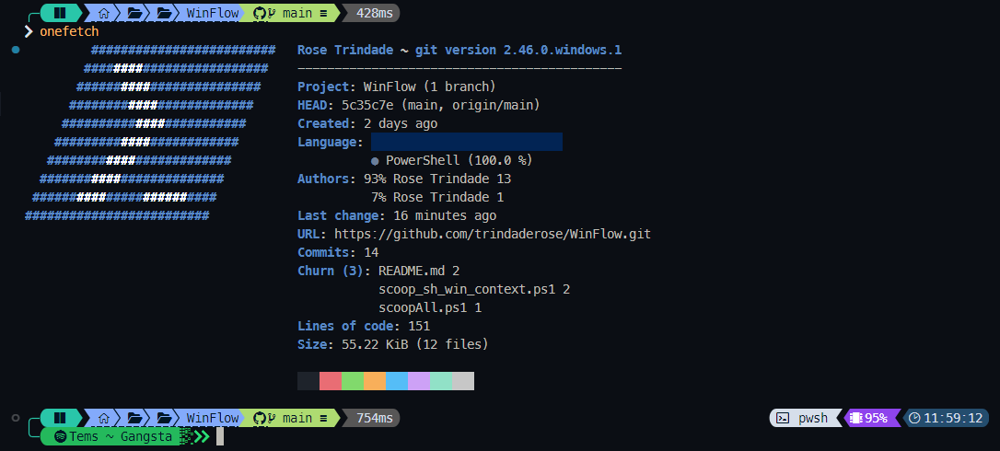

# WinFlow 

> .dotfiles

Ferramentas e utilitários essenciais para otimizar e personalizar o meu ambiente Windows.

## :gem: .exe & winget
[Winget](https://learn.microsoft.com/pt-br/windows/package-manager/winget/) - Gerenciador de pacotes para instalar aplicativos no Windows.

-   [Arc](https://arc.net/) - Navegador web moderno e altamente personalizável. *[instalação manual]*
   -   [winget-install](https://github.com/asheroto/winget-install) - Ferramenta para simplificar a instalação de aplicativos via Winget. *[instalação manual]*
   -   [WinGet-Essentials](https://github.com/jjcarrier/PS-WinGet-Essentials) - Conjunto de scripts essenciais para utilizar com o Winget. *[instalação manual]*
-   [UniGetUI](https://www.marticliment.com/unigetui/) - Interface gráfica para facilitar o uso do UniGet, um gerenciador de pacotes. *[instalação manual]*
-   [Glary Utilities](https://www.glarysoft.com/) - Conjunto de ferramentas para otimizar e melhorar o desempenho do seu PC. *[instalação manual]*
-   [Clockify](https://app.clockify.me/en/login) - *[instalação manual]*
-   [Remote Mouse](https://www.remotemouse.net/) - *[instalação manual]*
-   [VisiData](https://www.visidata.org/) - *[instalação manual]*
-   [Photoshop](https://www.adobe.com/br/products/photoshop.html)
-   [Illustrator](https://www.adobe.com/br/products/illustrator.html)

:wavy_dash:

-   [7-Zip](https://7-zip.org/) - Utilitário de compactação de arquivos de código aberto.
-   [PowerShell](https://learn.microsoft.com/pt-br/powershell/) - Ferramenta de linha de comando e linguagem de script para automação de tarefas.
-   [VSCode](https://code.visualstudio.com/) - Editor de código-fonte.
-   [OpenVPN](https://openvpn.net/) - Solução de VPN segura e de código aberto.
-   [OpenVPN Connect](https://openvpn.net/client/client-connect-vpn-for-windows/) - Cliente oficial do OpenVPN para Windows.
-   [Flow Launcher](https://www.flowlauncher.com/) - Raycast para Windows.
-   [Oh My Posh](https://ohmyposh.dev/) - Personalize seu prompt de terminal com temas e funcionalidades avançadas.
-   [Thunderbird](https://www.thunderbird.net/pt-BR/) - Cliente de e-mail gratuito e de código aberto.
-   [FontBase](https://fontba.se/) - Gerenciador de fontes.
-   [VLC](https://www.videolan.org/vlc/) - Reprodutor multimídia versátil e de código aberto.

:wavy_dash:

## :ice_cream: scoop apps
[Scoop](https://github.com/ThomasNieto/Scoop) - Gerenciador de pacotes para facilitar a instalação de software no Windows.

:small_blue_diamond: Windows context:

   -   [googlechrome](https://www.google.com/intl/pt-BR/chrome/)
   -   [onecommander](https://www.onecommander.com/) - Explorer.exe moderno e intuitivo.
   -   [easy-context-menu](https://www.sordum.org/7615/easy-context-menu-v1-6/) - Personalize o menu de contexto do Windows.
   -   [powertoys](https://github.com/microsoft/PowerToys) - Conjunto de utilitários para aumentar a produtividade no Windows.
   -   [attribute-changer](https://www.petges.lu/) - Ferramenta para alterar atributos de arquivos e pastas.
   -   [defraggler](https://www.ccleaner.com/defraggler) - Desfragmentador de disco simples e eficiente.
   -   [winfetch](https://github.com/lptstr/winfetch) - A command-line system information utility for Windows (same as >onefetch for repos)
   -   [transmission](https://transmissionbt.com/) - Cliente BitTorrent leve e light.
   -   [space-radar](https://github.com/zz85/space-radar) - Disk And Memory Space Visualization App built with Electron & d3.js.
   -   [ccleaner](https://www.ccleaner.com/ccleaner) - Ferramenta de limpeza para Windows.
   -   [lockhunter](https://lockhunter.com/) - Ferramenta para deletar arquivos bloqueados por outros processos.
   -   [spotify](https://www.spotify.com/) - Player principal.
   -   [discord](https://discord.com/) - Free Voice and Text Chat
   -   [openvpn](https://openvpn.net/) - Cliente VPN seguro e de código aberto.
   -   [openssl](https://github.com/o2sh/onefetch?tab=readme-ov-file) - Ferramenta robusta para criptografia e SSL/TLS.
   -   [windowsspyblocker](https://crazymax.dev/WindowsSpyBlocker/download/) - Ferramenta para proteger sua privacidade bloqueando espionagem no Windows.
   -   [snappy-driver-installer-origin](https://www.snappy-driver-installer.org/) - Ferramenta para instalar e atualizar drivers automaticamente.
   -   [sidebar-diagnostics](https://github.com/ArcadeRenegade/SidebarDiagnostics) - Monitore o hardware do seu PC iretamente na barra lateral.

:deciduous_tree: Dev context:

   -   [git](https://git-scm.com/) - Git CLI.
   -   [nodejs](https://nodejs.org) - An asynchronous event driven JavaScript runtime designed to build scalable network applications.
   -   [gitui](https://github.com/extrawurst/gitui) - Interface gráfica rápida e intuitiva para o Git.
   -   [lazygit](https://github.com/jesseduffield/lazygit) - Cliente Git simples e rápido para a linha de comando.
   -   [spicetify](https://spicetify.app/docs/advanced-usage/installation) - Super lightweight player & Developer Tools para Spotify.
   -   [terminal-icons](https://github.com/devblackops/Terminal-Icons) - Adicione ícones ao terminal.
   -   [ndm](https://github.com/720kb/ndm) - Gerenciador de pacotes para Node.js com interface gráfica.
   -   [glow](https://github.com/charmbracelet/glow) - Visualizador de Markdown para a linha de comando.
   -   [kondo](https://github.com/tbillington/kondo) - Limpe diretórios de projetos com facilidade.
   -   [carapace-bin](https://carapace-sh.github.io/carapace-bin/carapace-bin.html) - Completa comandos em várias ferramentas de linha de comando.
   -   [onefetch](https://github.com/o2sh/onefetch?tab=readme-ov-file) - Exibe informações e dados do repositório Git graficamente.
   -   [imagemagick](https://imagemagick.org/) - Conjunto de ferramentas para criar, editar e compor imagens.
   -   [csview](https://github.com/wfxr/csview) - Visualizador de arquivos CSV via terminal.
   -   [wrangler](https://developers.cloudflare.com/workers/tooling/wrangler) - Cloudflare CLI.
   -   [firefox-developer](https://www.mozilla.org/en-US/firefox/developer/) - Navegador secundário.
   -   [python](https://www.python.org/) - A programming language that lets you work quickly and integrate systems more effectively.
   -   [rstudio](https://posit.co/products/open-source/rstudio/) - Ambiente de desenvolvimento integrado para R.

## :sunflower: tema

-   [Vin Star](https://www.vinstartheme.com/) - Laborumut illo ad vitae cumque vero neque hic sint tempora autem illo.
-   [UltraUXThemePatcher](https://www.ultrauxthemepatcher.com/) - Permite a instalação de temas de terceiros no Windows.
-   [StartAllBack](https://www.startallback.com/) - Restaura e melhora o menu iniciar e a barra de tarefas do Windows.
-   [OldNewExplorer](https://learn.microsoft.com/pt-br/powershell/) - Personalize o Explorer do Windows para um estilo mais clássico.
    -   [ExplorerBlurMica](https://github.com/Maplespe/ExplorerBlurMica) - Adiciona efeitos de desfoque e Mica ao Explorer.
    -   [translucenttb](https://github.com/TranslucentTB/TranslucentTB) - Torna a barra de tarefas do Windows transparente e customizável.

:wavy_dash:

#### :icecream: interesting testing via scoop

:ghost: instalados:

   - [sampler](https://github.com/sqshq/sampler?tab=readme-ov-file) - A tool for shell commands execution, visualization and alerting.
   - [sonic-pi](https://sonic-pi.net/) - Ferramenta para criar música com código.
   - [moneyregex](https://moneymanagerex.org/) - Gerenciador financeiro pessoal de código aberto.

:raising_hand: outros:
- [nexusfont](https://www.xiles.app/) - Gerenciador de fontes leve e eficiente.
- [pdftk-builder](https://pdftk-builder-enhanced.sourceforge.io/) - Graphical interface to PDF ToolKit for document manipulation (merge, split, ...).
 - [picotorrent](https://github.com/picotorrent/picotorrent) - Cliente BitTorrent pequeno e rápido.
 - [processhacker](https://processhacker.sourceforge.io/) - Ferramenta para visualizar e gerenciar processos e serviços do Windows.
 - [pscolor](https://github.com/Davlind/PSColor?tab=readme-ov-file) - Adiciona cores ao PowerShell para melhor legibilidade.
 - [shiba](https://github.com/rhysd/Shiba) - Visualizador de Markdown com renderização em tempo real.
 - [sonic-visualiser](https://www.sonicvisualiser.org/) - Ferramenta para análise de áudio detalhada.
 - [runasti](https://github.com/jschicht/RunAsTI) - Launch processes with TrustedInstaller privilege.
