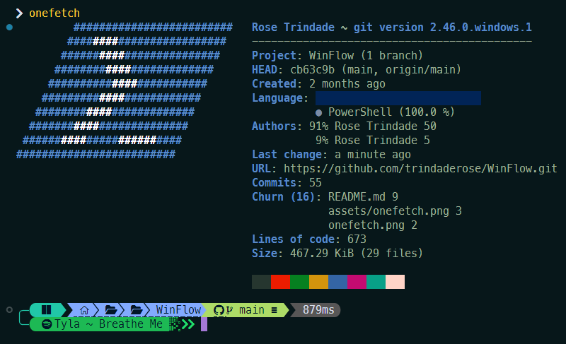

# WinFlow 

> .dotfiles

Ferramentas e utilitários essenciais para otimizar e personalizar o meu ambiente Windows.

## :gem: .exe & winget

-   [PowerShell](https://learn.microsoft.com/pt-br/powershell/) - Ferramenta de linha de comando e linguagem de script para automação de tarefas.
-   [Winget](https://learn.microsoft.com/pt-br/windows/package-manager/winget/) - Gerenciador de pacotes para instalar aplicativos no Windows.
-   [winget-install](https://github.com/asheroto/winget-install) - Ferramenta para simplificar a instalação de aplicativos via Winget.
-   [WinGet-Essentials](https://github.com/jjcarrier/PS-WinGet-Essentials) - Conjunto de scripts essenciais para utilizar com o Winget.
-   [Arc](https://arc.net/) - Navegador web moderno e altamente personalizável.
-   [UniGetUI](https://www.marticliment.com/unigetui/) - Interface gráfica para facilitar o uso do UniGet, um gerenciador de pacotes.
-   [Remote Mouse](https://www.remotemouse.net/) - Converta o seu celular num mouse.
-   [VisiData](https://www.visidata.org/) - VisiData is an interactive multitool for tabular data. It combines the clarity of a spreadsheet, the efficiency of the terminal, and the power of Python, into a lightweight utility which can handle millions of rows with ease.
-   [App Buster](https://www.oo-software.com/en/ooappbuster) - Bust Apps you do not want!
-   [Photoshop](https://www.adobe.com/br/products/photoshop.html)
-   [Illustrator](https://www.adobe.com/br/products/illustrator.html)

:wavy_dash:

-   [Flow Launcher](https://www.flowlauncher.com/) - Raycast para Windows.
-   [Open Refine](https://github.com/OpenRefine) - OpenRefine is a free, open source power tool for working with messy data and improving it.
-   [Spotify](https://www.spotify.com/) - Player principal.
-   [OpenVPN](https://openvpn.net/) - Solução de VPN segura e de código aberto.
-   [OpenVPN Connect](https://openvpn.net/client/client-connect-vpn-for-windows/) - Cliente oficial do OpenVPN para Windows.
-   [Color LS](https://github.com/athityakumar/colorls?tab=readme-ov-file) - A Ruby gem that beautifies the terminal's ls command, with color and font-awesome icons.

## :ice_cream: scoop apps

[Scoop](https://github.com/ThomasNieto/Scoop) - Gerenciador de pacotes para facilitar a instalação de software no Windows.

-   [git](https://git-scm.com/) - Git CLI.
-   [7zip](https://www.7-zip.org/) - Zip.
-   [vlc](https://www.videolan.org/vlc/) - Video Player.
-   [googlechrome](https://www.google.com/intl/pt-BR/chrome/) - Chrome.
-   [onecommander](https://www.onecommander.com/) - Explorer.exe moderno e intuitivo.
-   [oh-my-posh](https://ohmyposh.dev/) - A prompt theme engine for any shell.
-   [fontbase](https://fontba.se/) - Gerenciador de fontes eficiente.
-   [windowsspyblocker](https://crazymax.dev/WindowsSpyBlocker/download/) - Ferramenta para proteger sua privacidade bloqueando espionagem no Windows.
-   [easy-context-menu](https://www.sordum.org/7615/easy-context-menu-v1-6/) - Personalize o menu de contexto do Windows.
-   [powertoys](https://github.com/microsoft/PowerToys) - Conjunto de utilitários para aumentar a produtividade no Windows.
-   [attribute-changer](https://www.petges.lu/) - Ferramenta para alterar atributos de arquivos e pastas.
-   [defraggler](https://www.ccleaner.com/defraggler) - Desfragmentador de disco simples e eficiente.
-   [winfetch](https://github.com/lptstr/winfetch) - A command-line system information utility for Windows (same as >onefetch for repos)
-   [transmission](https://transmissionbt.com/) - Cliente BitTorrent leve.
-   [space-radar](https://github.com/zz85/space-radar) - Disk And Memory Space Visualization App built with Electron & d3.js.
-   [ccleaner](https://www.ccleaner.com/ccleaner) - Ferramenta de limpeza para Windows.
-   [lockhunter](https://lockhunter.com/) - Ferramenta para deletar arquivos bloqueados por outros processos.
-   [discord](https://discord.com/) - Free Voice and Text Chat.
-   [openssl](https://github.com/o2sh/onefetch?tab=readme-ov-file) - Ferramenta robusta para criptografia e SSL/TLS.
-   [snappy-driver-installer-origin](https://www.snappy-driver-installer.org/) - Ferramenta para instalar e atualizar drivers automaticamente.
-   [nodejs](https://nodejs.org) - An asynchronous event driven JavaScript runtime designed to build scalable network applications.
-   [gitui](https://github.com/extrawurst/gitui) - Interface gráfica rápida e intuitiva para o Git.
-   [lazygit](https://github.com/jesseduffield/lazygit) - simple terminal UI for git commands.
-   [spicetify](https://spicetify.app/docs/advanced-usage/installation) - Super lightweight player & Developer Tools para Spotify.
-   [terminal-icons](https://github.com/devblackops/Terminal-Icons) - Ícones ao terminal.
-   [cygwin](https://cygwin.com/) - A large collection of GNU and Open Source tools which provide functionality similar to a Linux distribution on Windows.
-   [ndm](https://github.com/720kb/ndm) - Gerenciador de pacotes para Node.js com interface gráfica.
-   [glow](https://github.com/charmbracelet/glow) - Visualizador de Markdown para a linha de comando.
-   [kondo](https://github.com/tbillington/kondo) - Limpe diretórios de projetos com facilidade.
-   [carapace-bin](https://carapace-sh.github.io/carapace-bin/carapace-bin.html) - Completa comandos em várias ferramentas de linha de comando.
-   [onefetch](https://github.com/o2sh/onefetch?tab=readme-ov-file) - Exibe informações e dados do repositório Git graficamente.
-   [imagemagick](https://imagemagick.org/) - Conjunto de ferramentas para criar, editar e compor imagens.
-   [csview](https://github.com/wfxr/csview) - Visualizador de arquivos CSV via terminal.
-   [firefox-developer](https://www.mozilla.org/en-US/firefox/developer/) - Navegador secundário.
-   [python](https://www.python.org/) - A programming language that lets you work quickly and integrate systems more effectively.
-   [rstudio](https://posit.co/products/open-source/rstudio/) - Ambiente de desenvolvimento integrado para R.
-   [vscode](https://code.visualstudio.com/) - Visual Studio Code.

## :sunflower: tema

-   [Vin Star](https://www.vinstartheme.com/) - Laborumut illo ad vitae cumque vero neque hic sint tempora autem illo.
-   [UltraUXThemePatcher](https://www.ultrauxthemepatcher.com/) - Permite a instalação de temas de terceiros no Windows.
-   [StartAllBack](https://www.startallback.com/) - Restaura e melhora o menu iniciar e a barra de tarefas do Windows.
-   [OldNewExplorer](https://www.oldnewexplorer.com/) - Personalize o Explorer do Windows para um estilo mais clássico.
-   [ExplorerBlurMica](https://github.com/Maplespe/ExplorerBlurMica) - Adiciona efeitos de desfoque e Mica ao Explorer.
-   [translucenttb](https://github.com/TranslucentTB/TranslucentTB) - Torna a barra de tarefas do Windows transparente e customizável.
-   [SecureUxTheme](https://github.com/namazso/SecureUxTheme) - A secure boot compatible in-memory UxTheme patcher.

#### :icecream: interesting testing via scoop

-   [pdftk-builder](https://pdftk-builder-enhanced.sourceforge.io/) - Graphical interface to PDF ToolKit for document manipulation (merge, split, ...).
-   [picotorrent](https://github.com/picotorrent/picotorrent) - Cliente BitTorrent pequeno e rápido.
-   [processhacker](https://processhacker.sourceforge.io/) - Ferramenta para visualizar e gerenciar processos e serviços do Windows.
-   [sonic-visualiser](https://www.sonicvisualiser.org/) - Ferramenta para análise de áudio detalhada.
-   [runasti](https://github.com/jschicht/RunAsTI) - Launch processes with TrustedInstaller privilege.
-   [moneyregex](https://moneymanagerex.org/) - Gerenciador financeiro pessoal de código aberto.
-   [sonic-pi](https://sonic-pi.net/) - Ferramenta para criar música com código.
-   [sampler](https://github.com/sqshq/sampler?tab=readme-ov-file) - A tool for shell commands execution, visualization and alerting.

#### py

-   [toga](https://toga.readthedocs.io/en/latest/index.html) - Toga is a Python native, OS native, cross platform GUI toolkit. Toga consists of a library of base components with a shared interface to simplify platform-agnostic GUI development.
-   [stig](https://github.com/rndusr/stig) - TUI and CLI for the BitTorrent client Transmission
-   [click](https://github.com/pallets/click/) - TUI and CLI for the BitTorrent client Transmission
